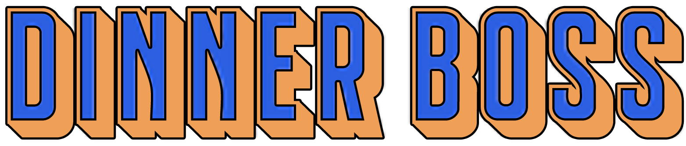

`Análise e Desenvolvimento de Sistemas`

`Projeto: Desenvolvimento de uma Aplicação Interativa - Turma 01`

`2021/2`

Devido a pandemia as pessoas tiveram que ficar em casa, muitos estabelecimentos fecharam temporariamente e com isso todos ficaram com medo de se contaminar. Mesmo depois da liberação para os restaurantes voltarem a abrir, ainda existe uma parte da população que não se sente segura em um local público, pois não tem muitas informações do local e se terá aglomeração.
Diante disso vemos que um sistema de agendamento para os comércios seria de grande ajuda para a população trazendo mais segurança na hora de sair de casa.

## Integrantes

* Felippe Diniz Faria Coelho
* Geovane Vinicius Lacerda Gomes
* José Flávio Miranda
* Ludmila Rangel Da Silva Guizan Pinheiro
* Maykell Alvim De França

## Orientadora

* Simone Alves Nogueira

## Instruções de utilização

Assim que a primeira versão do sistema estiver disponível, deverá complementar com as instruções de utilização. Descreva como instalar eventuais dependências e como executar a aplicação.

# Documentação

<ol>
<li><a href="docs/01-Documentação de Contexto.md"> Documentação de Contexto</a></li>
<li><a href="docs/02-Especificação do Projeto.md"> Especificação do Projeto</a></li>
<li><a href="docs/03-Metodologia.md"> Metodologia</a></li>
<li><a href="docs/04-Projeto de Interface.md"> Projeto de Interface</a></li>
<li><a href="docs/05-Arquitetura da Solução.md"> Arquitetura da Solução</a></li>
<li><a href="docs/06-Template Padrão da Aplicação.md"> Template Padrão da Aplicação</a></li>
<li><a href="docs/07-Programação de Funcionalidades.md"> Programação de Funcionalidades</a></li>
<li><a href="docs/08-Plano de Testes de Software.md"> Plano de Testes de Software</a></li>
<li><a href="docs/09-Registro de Testes de Software.md"> Registro de Testes de Software</a></li>
<li><a href="docs/10-Plano de Testes de Usabilidade.md"> Plano de Testes de Usabilidade</a></li>
<li><a href="docs/11-Registro de Testes de Usabilidade.md"> Registro de Testes de Usabilidade</a></li>
<li><a href="docs/12-Apresentação do Projeto.md"> Apresentação do Projeto</a></li>
<li><a href="docs/13-Referências.md"> Referências</a></li>
</ol>

# Código

<li><a href="src/README.md"> Código Fonte</a></li>

# Apresentação

<li><a href="presentation/README.md"> Apresentação da solução</a></li>
