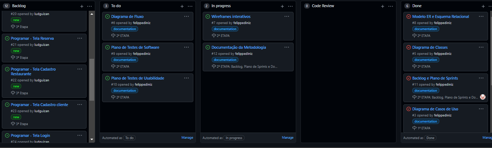

# Metodologia

Pré-requisitos: <a href="2-Especificação do Projeto.md"> Documentação de Especificação</a>

## Controle de Versão

A ferramenta de controle de versão adotada no projeto foi o Git, sendo que o Github
foi utilizado para hospedagem do repositório.

O projeto segue a seguinte convenção para o nome de branches:

- `main`: versão estável já testada do software
- `testing`: versão em testes do software
- `dev`: versão de desenvolvimento do software

Quanto à gerência de issues, o projeto adota a seguinte convenção para
etiquetas:

- `documentation`: melhorias ou acréscimos à documentação
- `bug`: uma funcionalidade encontra-se com problemas
- `improve`: uma funcionalidade precisa ser melhorada
- `new`: uma nova funcionalidade precisa ser introduzida

## Gerenciamento de Projeto

### Divisão de Papéis

* Scrum Master: Ludmila Rangel da Silva Guizan Pinheiro
* Product Owner: Maykell Alvim De França
* Equipe de Desenvolvimento:
  * Felippe Diniz Faria Coelho
  * Geovane Vinicius Lacerda Gomes
  * José Flávio Miranda
  * Ludmila Rangel Da Silva Guizan Pinheiro
  * Maykell Alvim De França
  * Rafael Xavier Rezende
* Equipe de Design
  * Ludmila Rangel da Silva Guizan Pinheiro

### Processo

Para organização e distribuição das tarefas do projeto, a equipe está utilizando o Github estruturado com as seguintes listas: 

**Backlog**:  Representa o Product Backlog. Todas as atividades identificadas no decorrer do projeto irão ser incorporadas a esta lista.

**To Do**: Esta lista representa o Sprint Backlog. Este é o Sprint atual que estamos trabalhando. 

**In progress**: Quando uma tarefa tiver sido iniciada, ela é movida para cá. 

**Code Review:** Esta lista é para itens na revisão de código. 

**Done**: nesta lista são colocadas as tarefas que passaram pelos testes e controle de qualidade e estão prontos para ser entregues ao usuário. Não há mais edições ou revisões necessárias, ele está agendado e pronto para a ação. 

Abaixo uma imagem do Quadro Kanban do grupo no Github:

### Ferramentas

O projeto será desenvolvidos a partir de diversas plataformas e a relação dos ambientes com seu respectivo propósito é apresentada na tabela a seguir: 

|           **Ambiente**            |                        **Plataforma**                        |
| :-------------------------------: | :----------------------------------------------------------: |
|    Repositório de código fonte    |                            GitHub                            |
|         Editor de código          |                      Visual Studio Code                      |
|       Documentos do projeto       |                    Office online / Teams                     |
| Projeto de Interface e Wireframes | <a href="https://www.figma.com/file/Pnb7Jx6c6urs71y3YPfSuT/Projeto-De-Agendamento?node-id=0%3A1" target="_blank">Figma</a> |
|     Gerenciamento do Projeto      | <a href="https://github.com/ICEI-PUC-Minas-PMV-ADS/pmv-ads-2021-2-e2-proj-int-t1-t1-grupo-2/projects" target="_blank">Github</a> |
|             Diagramas             |                          Lucidchart                          |
|            Comunicação            |                       WhatsApp e Teams                       |

