# Projeto de Interface

Pré-requisitos: <a href="2-Especificação do Projeto.md"> Documentação de Especificação</a>

Visão geral da interação do usuário pelas telas do sistema e protótipo interativo das telas com as funcionalidades que fazem parte do sistema (wireframes).

 Apresente as principais interfaces da plataforma. Discuta como ela foi elaborada de forma a atender os requisitos funcionais, não funcionais e histórias de usuário abordados nas <a href="2-Especificação do Projeto.md"> Documentação de Especificação</a>.

## Diagrama de Fluxo

O diagrama apresenta o estudo do fluxo de interação do usuário com o sistema interativo e  muitas vezes sem a necessidade do desenho do design das telas da interface. Isso permite que o design das interações seja bem planejado e gere impacto na qualidade no design do wireframe interativo que será desenvolvido logo em seguida.

O fluxograma está disponível pelo link abaixo:
https://lucid.app/lucidchart/5e08db9d-2248-4b91-a6a1-0890698dc658/edit?viewport_loc=-441%2C-4113%2C3330%2C1290%2C0_0&invitationId=inv_4f0fabae-3ee9-4de2-8051-95f50bb6c280.

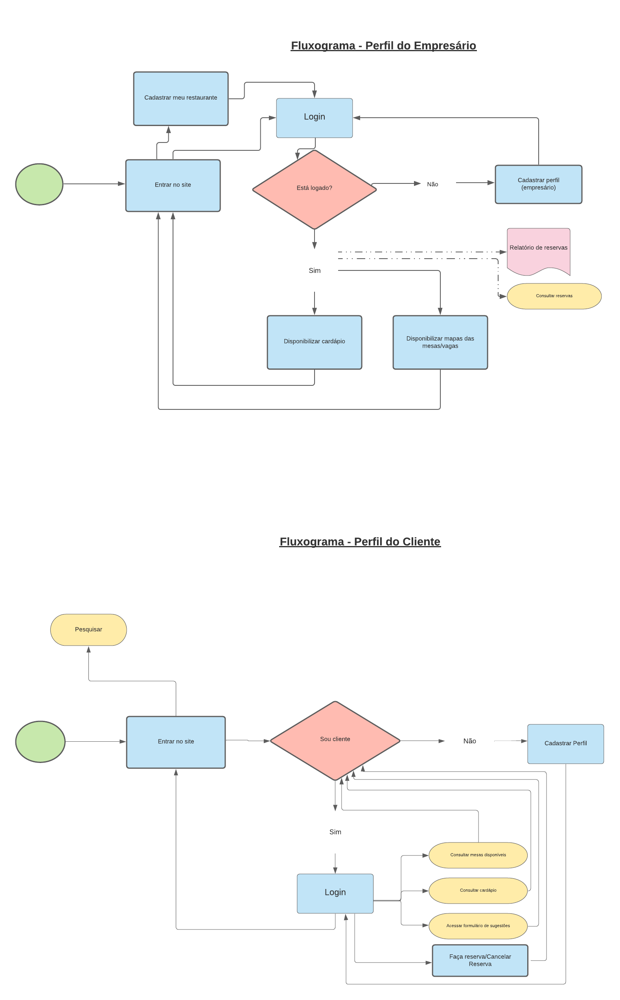

## Wireframes

<a href="https://www.figma.com/proto/Pnb7Jx6c6urs71y3YPfSuT/Projeto-De-Agendamento?node-id=1%3A2&scaling=min-zoom&page-id=0%3A1&starting-point-node-id=1%3A2" target="_blank"> Wireframe Interativo</a>

**Tela 1 - Home**

**Tela 2 - Login**

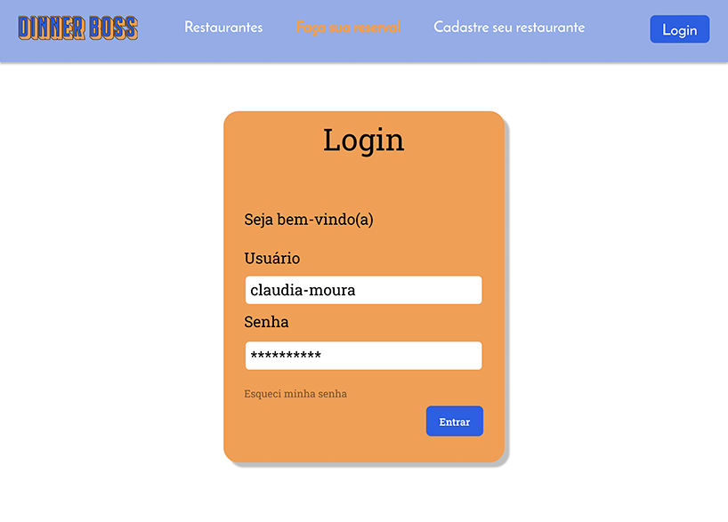

**Tela 3 - Perfil de cliente**

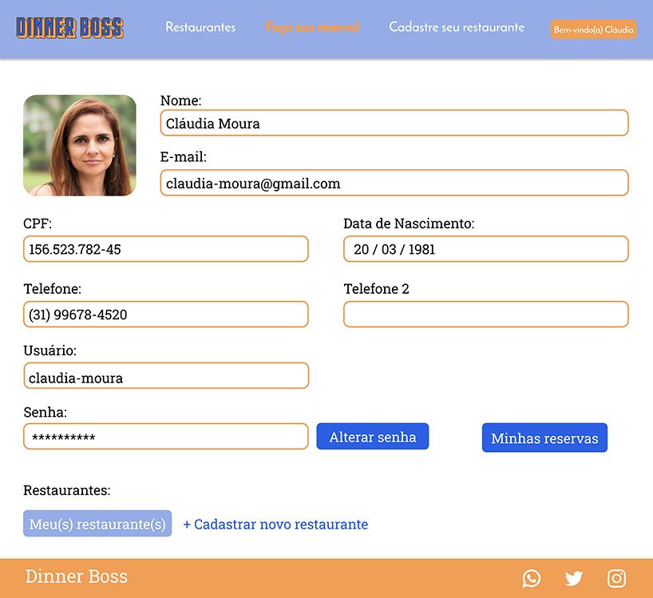

**Tela 4 - Perfil do empresário**

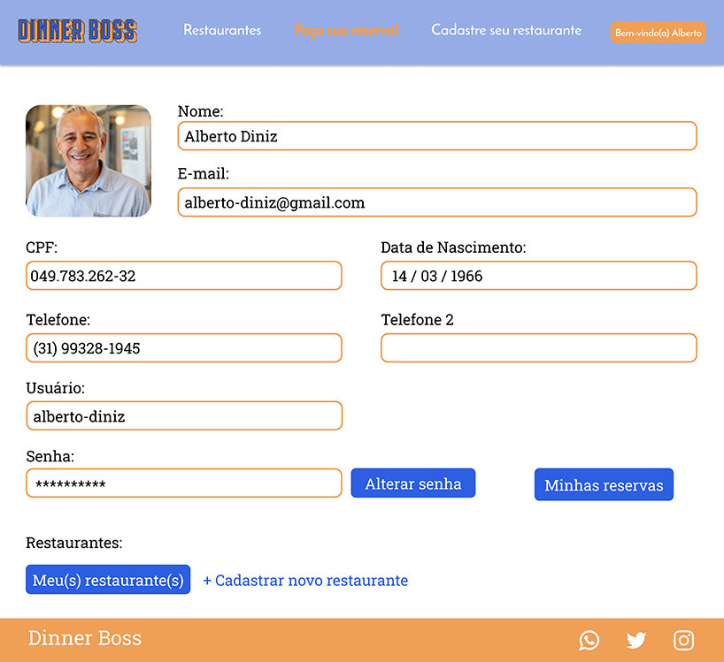

**Tela 5 - Perfil dos restaurantes**

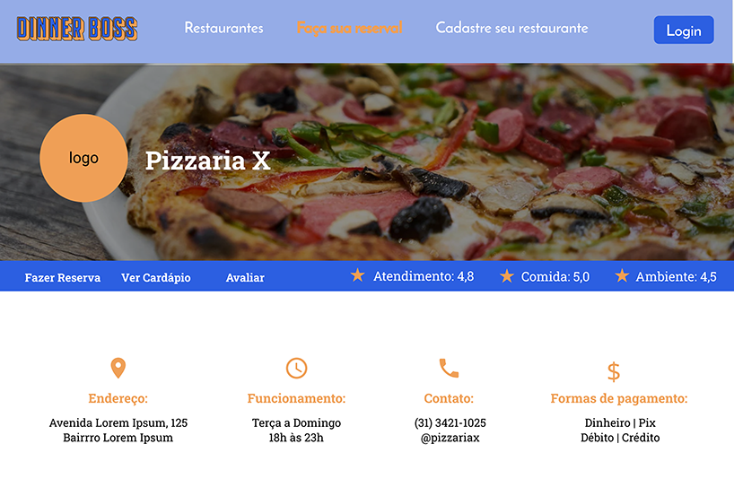

**Tela 6 - Cadastro de clientes**

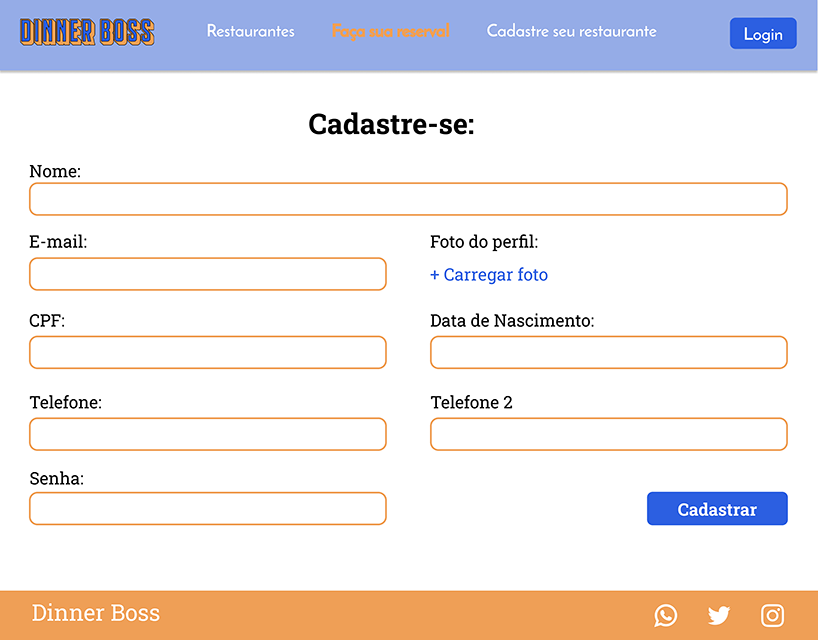

**Tela 7 - Cadastro de restaurantes**

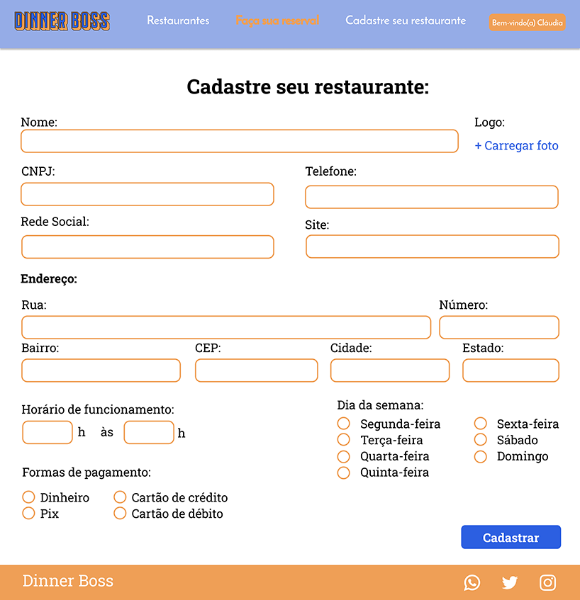

**Tela 8 -  Restaurante cadastrado**

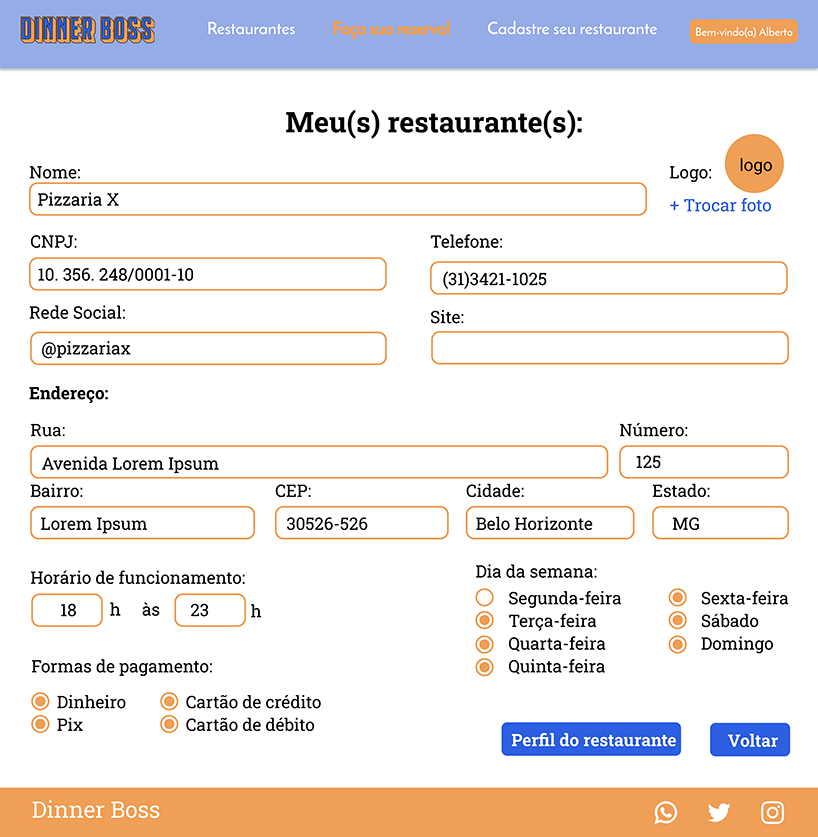

**Tela 9 - Busca dos Restaurantes**

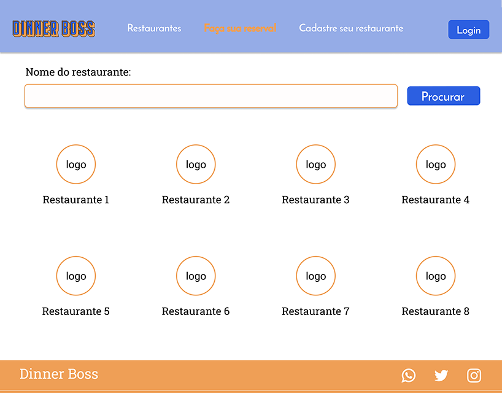

**Tela 10 - Fazer Reservas**

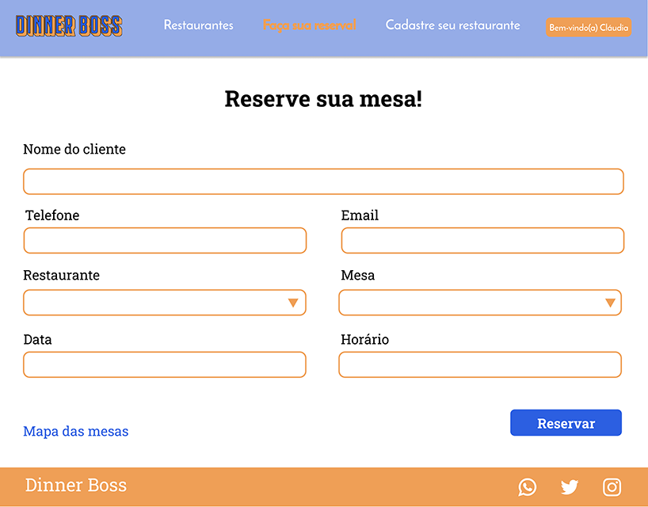

**Tela 11 - Mapa das mesas**

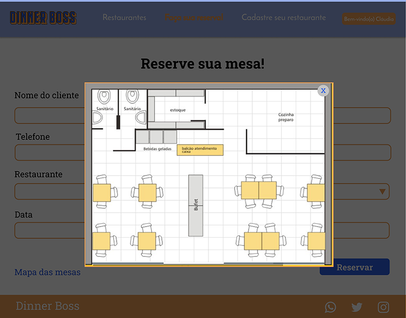

**Tela 12 - Informações da reserva no perfil**

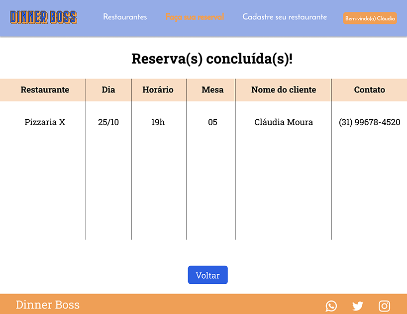

**Tela 13 - Avaliação dos Restaurantes**

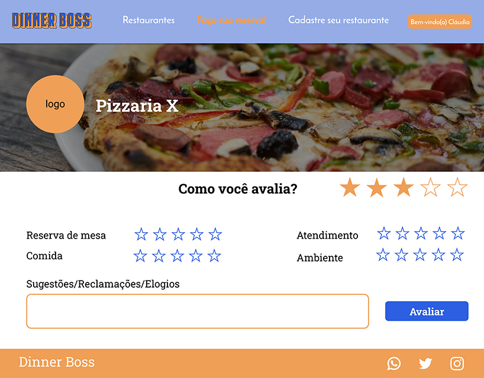

**Tela 14 - Cardápio**

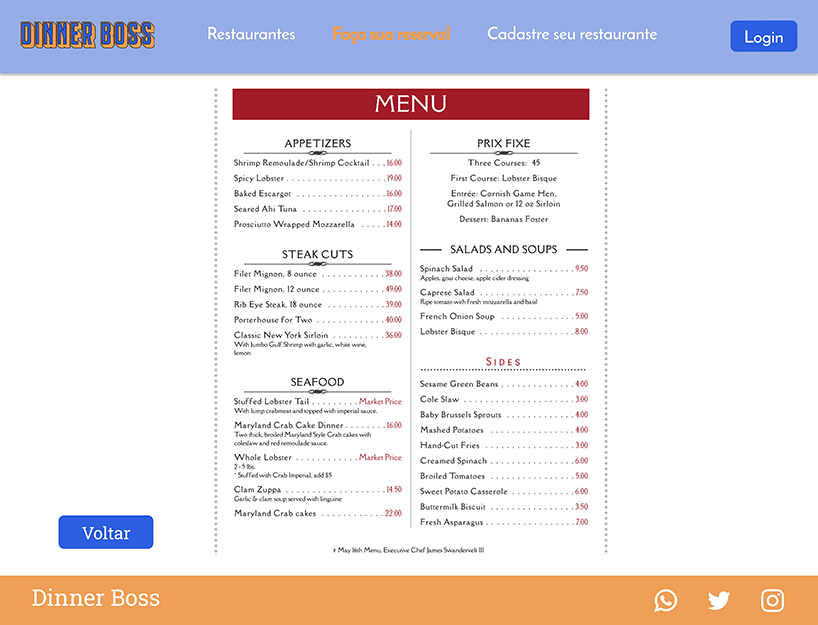

