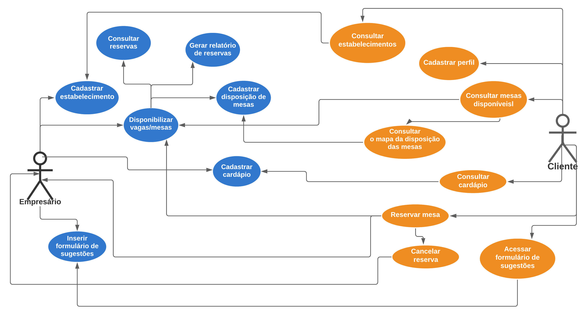

# Especificações do Projeto

## Personas

## Histórias de Usuários

Com base na análise das personas forma identificadas as seguintes histórias de usuários:

| EU COMO... `PERSONA` |              QUERO/PRECISO ... `FUNCIONALIDADE`              |                   PARA ... `MOTIVO/VALOR`                    |
| :------------------: | :----------------------------------------------------------: | :----------------------------------------------------------: |
|    Empresário(a)     |                 Disponibilizar vagas/mesas.                  | Para melhor planejamento e fazendo assim o controle da lotação do estabelecimento. |
|    Empresário(a)     |                     Disposição das mesas                     |   Cumprimento das normas sanitárias com o distanciamento.    |
|    Empresário(a)     |                  Disponibilizar o cardápio.                  | Para que seus clientes saibam o que pode ser consumido naquela reserva. |
|    Empresário(a)     |   Gerar relatórios de quantas reservas foram confirmadas.    |         Controlar o fluxo de pessoas no restaurante.         |
|    Empresário(a)     |               Um sistema de fácil utilização.                | Para pessoas com pouca familiaridade com a tecnologia conseguirem reservar sua mesa de forma mais fácil. |
|    Empresário(a)     | Cancelamento em até 30 minutos antes do horário já reservado. |           Liberando a mesa para futuros clientes.            |
|    Empresário(a)     |       Inserir formulário de elogios e/ou reclamações.        |                Receber o feedback do cliente.                |
|       Cliente        |                 Consultar estabelecimentos.                  |              Poder conhecer novos restaurantes.              |
|       Cliente        |             Consultar disponibilidade de mesas.              | Saber qual a lotação daquele dia. Pois assim poderá escolher qual restaurante naquele momento está com vagas ou não e sem aglomeração. |
|       Cliente        |      Consultar disposição das mesas no estabelecimento.      |       Escolher um local que se sente mais confortável.       |
|       Cliente        |                       Cancelar reserva                       |             Devido as emergências e imprevistos.             |
|       Cliente        |                Reservar a mesa pelo celular.                 |          Conseguir fazer a reserva de onde estiver.          |
|       Cliente        |     Com ícones e com poucas etapas para fazer a reserva.     | Para ser uma plataforma acessível a todos com um visual bem intuitivo. |
|       Cliente        |                    Consultar o cardápio.                     | Poder escolher o restaurante de acordo com o seu gosto e/ou dieta. |
|       Cliente        |       Incluir quantos acompanhantes haverá na reserva.       | Para que o sistema possa redimensionar as vagas disponíveis tendo em vista a lotação adequada do estabelecimento. |
|       Cliente        |   Acesso a formulários para avaliação do estabelecimento.    |      Para fazer elogios ou reclamações do restaurante.       |

## Requisitos

As tabelas que se seguem apresentam os requisitos funcionais e não funcionais que detalham o escopo do projeto.

### Requisitos Funcionais

|ID    | Descrição do Requisito  | Prioridade |
|------|-----------------------------------------|----|
|RF-001| Na página principal deve conter informações relacionadas ao restaurante como horário de funcionamento, serviço de entrega e agendamento de reservas. | ALTA |
|RF-002| Cadastro para novos restaurantes.                            | ALTA |
|RF-003| Cadastro para novos usuários.                                | ALTA |
|RF-004| Cadastro das mesas disponíveis.                              | ALTA       |
|RF-005| Formulário de agendamento de reservas.                       | ALTA       |
|RF-006| Relatórios das reservas.                                     | ALTA       |
|RF-007| Número de acompanhantes na reserva.                          | ALTA |
|RF-008| Conter uma aba para mostrar os clientes reservados com data e hora da reserva. | ALTA |
|RF-009| Cancelamento de reserva.                                     | ALTA |
|RF-010| Cadastro do cardápio.                                        | MÉDIA |
|RF-011| Visualização do cardápio atualizado. | MÉDIA |
|RF-012| Formulário para elogios e/ou reclamações. | MÉDIA |
|RF-013| O site deve permitir visualizar as informações das formas de contato direto (Whatsapp, telefone, e-mail). | MÉDIA |
|RF-014| O site deve separar estabelecimentos de clientes. | MÉDIA |
|RF-015| Função de pesquisas no sistema.                              | MÉDIA      |
|RF-016| Filtrar estabelecimentos conforme o cliente pesquisar        | MÉDIA      |
|RF-017| Sessão para depoimento de clientes.                          | BAIXA      |

### Requisitos não Funcionais

|ID     | Descrição do Requisito  |Prioridade |
|-------|-------------------------|----|
|RNF-001| O site deve ser publicado em um ambiente acessível publicamente na Internet (Repl.it, GitHub Pages, Heroku). | ALTA |
|RNF-002| O site deverá ser responsivo permitindo a visualização em um celular de forma adequada. | ALTA |
|RNF-003| O site deve ser compatível com os principais navegadores do mercado (Google Chrome, Firefox, Microsoft Edge). | ALTA |
|RNF-004| O site deve ter bom nível de contraste entre os elementos da tela em conformidade. | MÉDIA |
|RNF-005| Desenvolvimento utilizando Frameworks apropriados para Web. | MÉDIA |

## Restrições

O projeto está restrito pelos itens apresentados na tabela a seguir.

| ID   | Restrição                                                    |
| ---- | ------------------------------------------------------------ |
| 01   | O projeto deverá ser entregue no final do semestre letivo, não podendo extrapolar a data de 15/12/2021. |
| 02   | O aplicativo deve se restringir às tecnologias básicas do Front-end e Back-end, assim como contar com um serviço funcional de banco de dados. |
| 03   | A equipe não pode subcontratar o desenvolvimento do trabalho. |
| 04   | Com a finalidade de evitar spam, o aplicativo só poderá ser utilizado por clientes e donos de estabelecimentos cadastrados no banco de dados do projeto. |
| 05   | Clientes não vão poder fazer mais de uma reserva de mesmo horário em mais de um estabelecimento. |
| 06   | Algumas funcionalidades do programa estarão restritas para os donos de estabelecimento. |

## Diagrama de Casos de Uso

