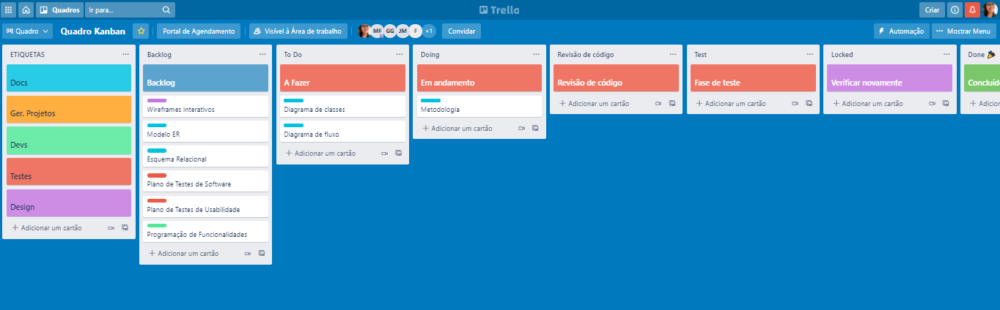

# Metodologia

Pré-requisitos: <a href="2-Especificação do Projeto.md"> Documentação de Especificação</a>

## Controle de Versão

A ferramenta de controle de versão adotada no projeto foi o Git, sendo que o Github
foi utilizado para hospedagem do repositório.

O projeto segue a seguinte convenção para o nome de branches:

- `main`: versão estável já testada do software
- `unstable`: versão já testada do software, porém instável
- `testing`: versão em testes do software
- `dev`: versão de desenvolvimento do software

Quanto à gerência de issues, o projeto adota a seguinte convenção para
etiquetas:

- `documentation`: melhorias ou acréscimos à documentação
- `bug`: uma funcionalidade encontra-se com problemas
- `enhancement`: uma funcionalidade precisa ser melhorada
- `feature`: uma nova funcionalidade precisa ser introduzida

## Gerenciamento de Projeto

### Divisão de Papéis

* Scrum Master: 
* Product Owner: 
* Equipe de Desenvolvimento:
  * Felippe Diniz Faria Coelho
  * Geovane Vinicius Lacerda Gomes
  * José Flávio Miranda
  * Ludmila Rangel Da Silva Guizan Pinheiro
  * Maykell Alvim De França
  * Rafael Xavier Rezende
* Equipe de Design
  * Ludmila Rangel da Silva Guizan Pinheiro
  * 

### Processo

Para organização e distribuição das tarefas do projeto, a equipe está utilizando o Trello estruturado com as seguintes listas: 

**Etiquetas**: esta lista mantém template de tarefas recorrentes com as configurações padronizadas que todos devem seguir. 

**Backlog**: recebe as tarefas a serem trabalhadas e representa o Product Backlog. Todas as atividades identificadas no decorrer do projeto irão ser incorporadas a esta lista. 

**To Do**: Esta lista representa o Sprint Backlog. Este é o Sprint atual que estamos trabalhando. 

**Doing**: Quando uma tarefa tiver sido iniciada, ela é movida para cá. 

**Code Review:** Esta lista é para itens na revisão de código. Quando uma tarefa é aprovada, passa para Teste. Se houver muitos cartões aqui, devemos interromper outras tarefas para concluir a revisão do código.

**Test**: Os cartões chegam aqui após a revisão do código e estamos prontos para o controle de qualidade e para corrigir as coisas que o controle de qualidade encontra.

**Locked**: Quando alguma coisa impede a conclusão da tarefa, ela é movida para esta lista juntamente com um comentário sobre o que está travando a tarefa. 

**Done**: nesta lista são colocadas as tarefas que passaram pelos testes e controle de qualidade e estão prontos para ser entregues ao usuário. Não há mais edições ou revisões necessárias, ele está agendado e pronto para a ação. 

Abaixo uma imagem do Quadro Kanban do grupo no Trello:

### Ferramentas

O projeto será desenvolvidos a partir de diversas plataformas e a relação dos ambientes com seu respectivo propósito é apresentada na tabela a seguir: 

|           **Ambiente**            |    **Plataforma**     |
| :-------------------------------: | :-------------------: |
|    Repositório de código fonte    |        GitHub         |
|         Editor de código          |  Visual Studio Code   |
|       Documentos do projeto       | Office online / Teams |
| Projeto de Interface e Wireframes |         Figma         |
|     Gerenciamento do Projeto      |        Trello         |
|             Diagramas             |      Lucidchart       |
|            Comunicação            |   WhatsApp e Teams    |

