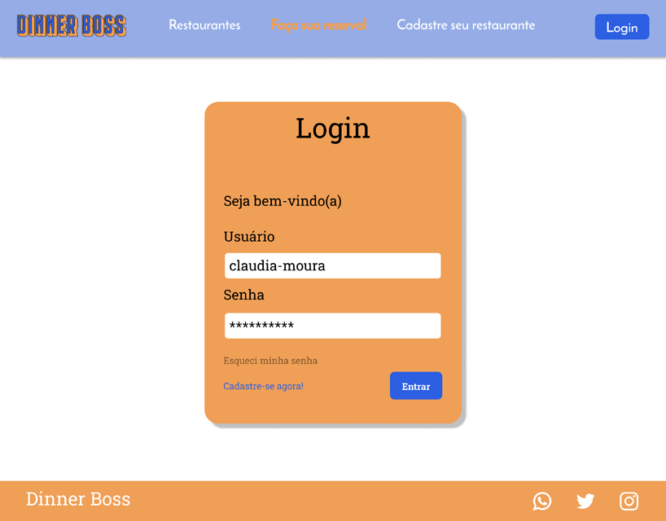

# Template Padrão da Aplicação

Pré-requisitos: <a href="2-Especificação do Projeto.md"> Especificação do Projeto</a>, <a href="3-Projeto de Interface.md"> Projeto de Interface</a>, <a href="4-Metodologia.md"> Metodologia</a>

Layout padrão da aplicação que será utilizado em todas as páginas com a definição de identidade visual, aspectos de responsividade e iconografia.

O padrão de layout a ser utilizado pelo site tem correspondência ao projeto de Interface elaborado anteriormente, conforme a figura abaixo:

Para a identidade visual do site, será usada as cores laranja e azul de acordo com a logo do projeto.

 ***Laranja - #EF9F56***

 ***Azul - #2C5FE1***

 ***Azul claro - #95ACE7***

A responsividade segue o padrão do Bootstrap.

Abaixo algumas imagens mostrando o layout:

**Home** 

**Login**

**Cadastro de restaurantes**

