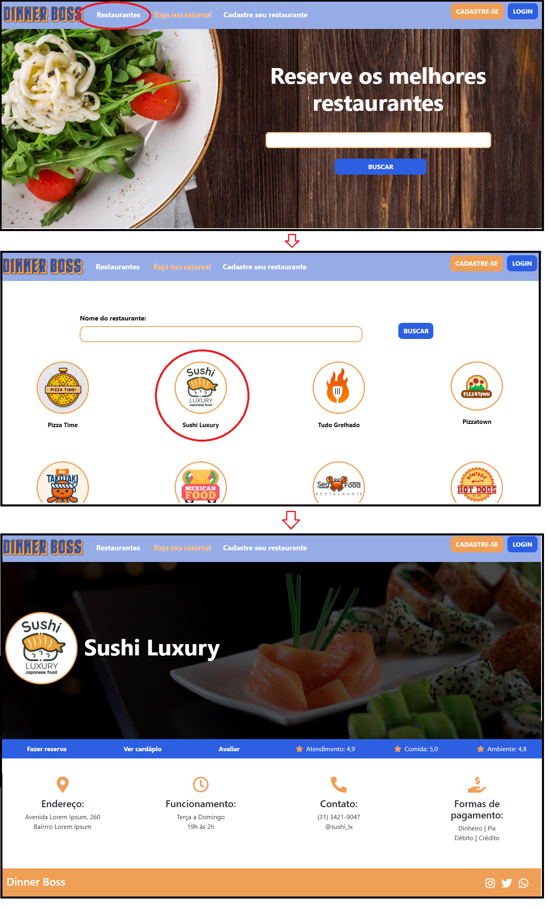
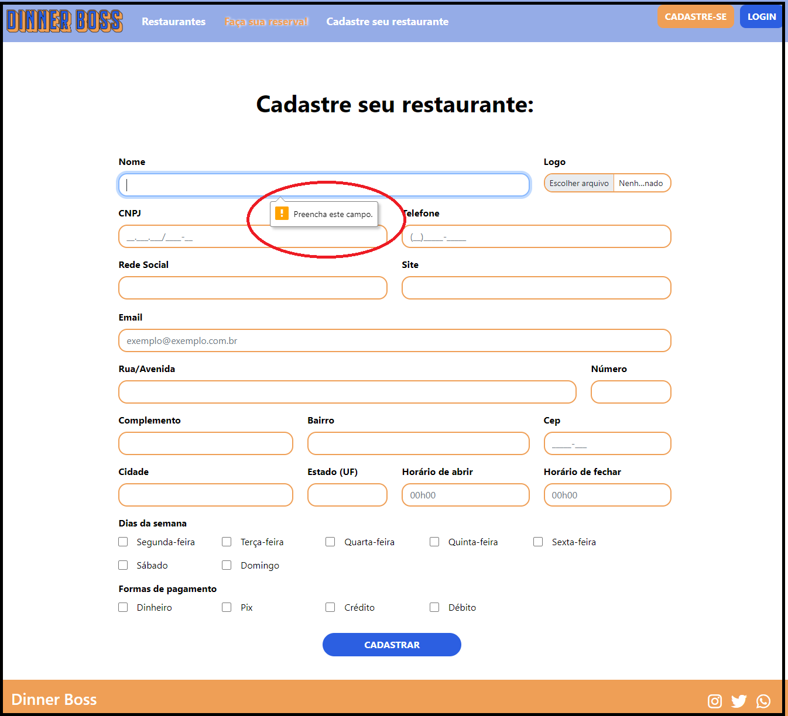

# Registro de Testes de Software

| **Caso de Teste**         | **CT-01 – Navegação**                                        |
| ------------------------- | ------------------------------------------------------------ |
| **Requisitos Associados** | RF-001, RF-013, RF-017                                       |
| **Objetivo do Teste**     | Validar o carregamento do site (index.html) bem como suas funcionalidades de visualização de forma esperada. |
| **Passos**                | 1) Acessar o Navegador e informar o endereço do Site.  2) Acessar os links vinculados aos restaurantes  3) Acessar os formulários para agendamento de reserva,  informações de contato e cardápio.   |
| **Critérios de Êxito**    | Validar se as páginas html carregam corretamente.            |
| **Registro**              | Todas as páginas estão carregando e conectadas de forma correta e esperada. |

| **Caso de Teste**         | **CT-02 – Formulários de cadastro**                          |
| ------------------------- | ------------------------------------------------------------ |
| **Requisitos Associados** | RF-002, RF-003, RF-004, RF-010                               |
| **Objetivo do Teste**     | Validar o preenchimento dos campos dos formulários de cadastro. |
| **Passos**                | 1) Acessar o formulário de cadastro de restaurantes e clientes;  2) Preencher todos os campos obrigatórios.   |
| **Critérios de Êxito**    | Exibir um aviso para os campos obrigatórios que estiverem vazio. |
| **Registro**              | Todos os campos obrigatórios dos formulários de cadastro de cliente e de restaurante estão com aviso para serem preenchidos. |

Obs.: Ainda não foi realizado os outros testes devido não ter todas funcionalidades programadas ainda!
