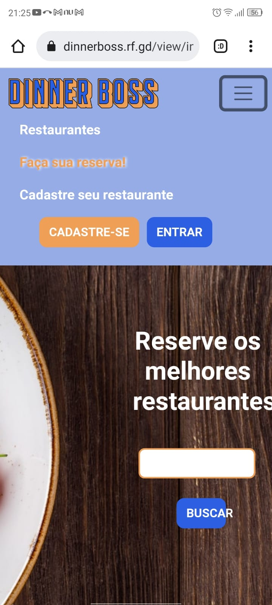
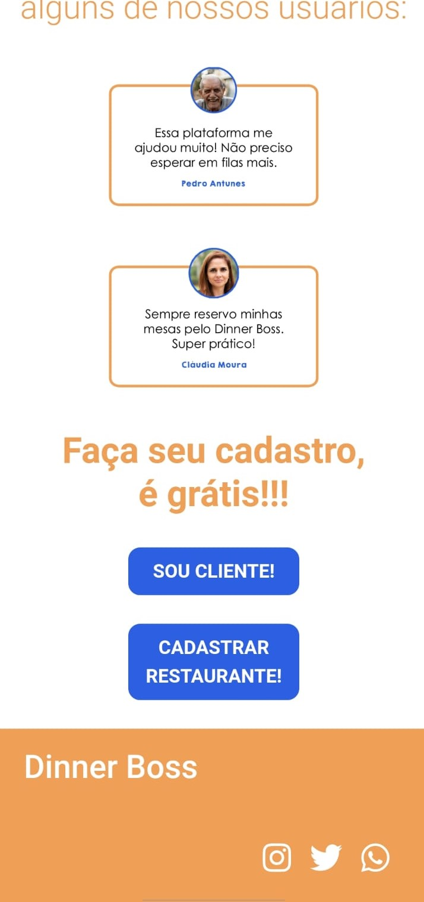
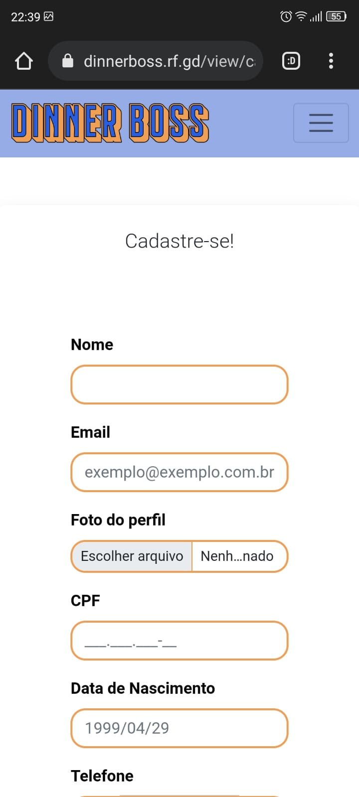

# Plano de Testes de Usabilidade

<table>
    <thead>
        <tr> 
            <th>Caso do Teste de Usabilidade</th>
            <th>CTU-01 - Testar a responsividade do site</th>
        </tr>
    </thead>
       <tbody>
        <tr> 
            <td>Objetivos do Teste</td>
            <td>
                Verificar se o site é responsivel de maneira satisfatória tanto em computadores quanto em smartphones.
            </td>
        </tr>
        <tr> 
            <td>Critérios de Êxito</td>
            <td>
                Deve ser possível acessar e compreender todo o conteúdo do site através de ambos os dispositivos.
            </td>
        </tr>
            <tr> 
                <td>
                    Testes executados
                </td>
                <td>
                    1) Foi testado pelo link do projeto hospedado pela plataforma https://infinityfree.net/;  o acesso pelo dispositivo móvel smartphone.  
                    2) Acessado o link do projeto https://dinnerboss.rf.gd/view/index.php   pelo dispositivo móvel smartphone tem acesso completo à home do projeto. Conforme demonstrado na telas que se segue.
                    
 
                        
                          
                        3) Tela de cadastro sendo executada com a responsividade esperada. <vr>
                          <vr>
                    

                </td>
           </tr>
</table>

<table>
    <thead>
        <tr> 
            <th>Caso do Teste de Usabilidade</th>
            <th>CTU-02 - Avaliar o layout de navegação</th>
        </tr>
    </thead>
       <tbody>
        <tr> 
            <td>Objetivos do Teste</td>
            <td>
                Verificar se é possível encontrar todas as funções de forma fácil e rápida.
            </td>
        </tr>
        <tr> 
            <td>Critérios de Êxito</td>
            <td>
                O usuário deve conseguir acessar todas as funcionalidades do site sem precisar realizar muitos cliques e passar por muitas telas.
            </td>
        </tr>
    </tbody>
</table>

